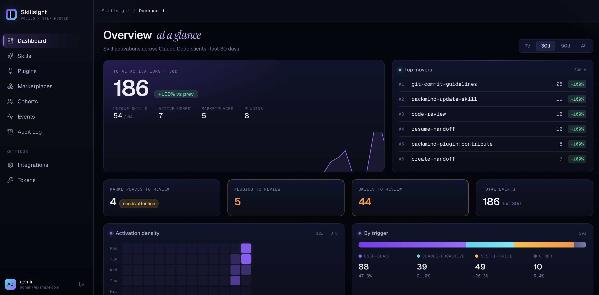
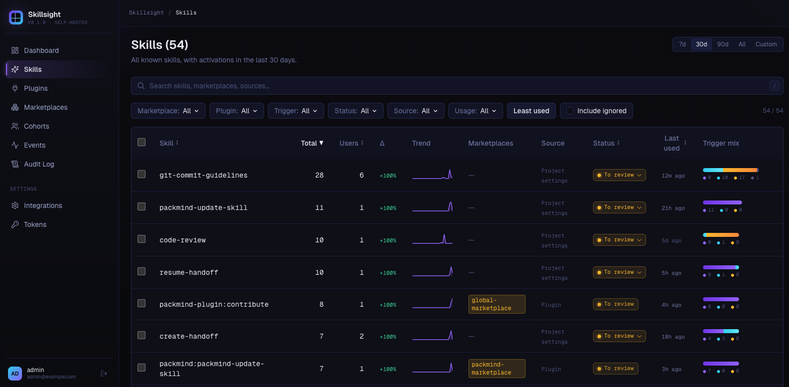
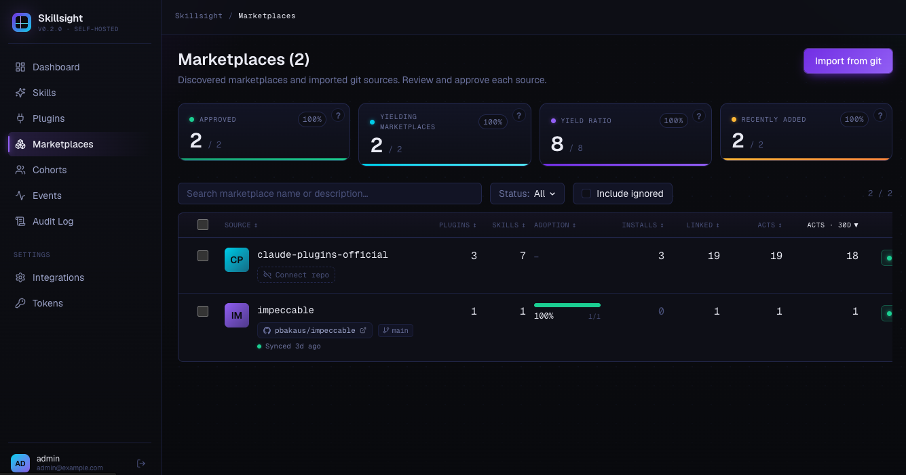

#  Skillsight

**A self-hosted dashboard for understanding how your team uses Claude Code skills.**



## Table of contents

- [The problem](#the-problem)
- [How Skillsight solves it](#how-skillsight-solves-it)
- [Who it's for](#who-its-for)
- [What you get](#what-you-get)
- [The Skills / Plugins / Marketplaces model](#the-skills--plugins--marketplaces-model)
- [Use cases](#use-cases)
- [Quick start](#quick-start)
- [Connecting Claude Code](#connecting-claude-code)
- [Ingesting from Loki instead](#ingesting-from-loki-instead)
- [Marketplace sources](#marketplace-sources)
- [How this relates to Claude Code's native controls](#how-this-relates-to-claude-codes-native-controls)
- [Contributing](#contributing)
- [Roadmap](#roadmap)
- [Architecture](#architecture)

## The problem

You've rolled Claude Code out across your org. You've published an internal marketplace with curated skills, plugins, and agents. Now you're flying blind:

- Which skills are developers **actually activating** — and which are gathering dust?
- Is anyone using the security-review skill you spent two weeks polishing?
- Which third-party plugins did your team install on their own, and should you officially adopt them or steer the team elsewhere?
- When you deprecate a skill, who needs a heads-up?

Claude Code emits an OpenTelemetry event for every skill activation, but it ships **no dashboard for the team rolling skills out**. Generic observability stacks (Grafana, Datadog, …) ingest those events fine — but they don't understand the **skill → plugin → marketplace** model, so turning raw logs into a curated catalog is painful, manual work.

## How Skillsight solves it

Skillsight is the missing thin layer. It does **three** things:

1. **Collects** Claude Code skill-activation events — directly via OTLP, or pulled from an existing Loki stack.
2. **Correlates** them against your plugins and marketplaces (including private, git-backed ones).
3. **Shows you** which skills, plugins, and marketplaces are actually being used — and lets you triage them (`to_review` → `approved` / `removed` / `denied`).

No agents, no auto-remediation, no LLM-on-top. Just a clean, focused view of skill usage with the right relationships to make sense of it.

**Self-hosted, by design.** One `docker compose up` and you're running. No SaaS, no outbound telemetry — Claude Code activity stays on your servers, period.

## Who it's for

- **Developer-experience teams** rolling Claude Code out internally.
- **AI-enablement teams** curating an internal skills/plugins marketplace.
- **Platform engineering** measuring the ROI of skills they build or import.

Built to support **adoption and curation**, not to surveil developers.

## What you get



- **Dashboard** — top-moving skills, week-over-week trends, activation counts split by trigger (user slash, Claude-proactive, nested).
- **Skills** — every skill ever activated, with status (`to_review` / `approved` / `removed` / `denied`), last-used timestamp, drill-down for triggers and users.
- **Plugins** — read-only list of plugins that own activated skills.
- **Marketplaces** — list of marketplaces, synced from git sources or implicit from inline plugins.
- **Tokens** — manage bearer tokens used for OTLP ingestion.
- **Settings → Integrations** — Loki integrations for pull-based ingestion.
- **Audit log** — every write operation, with CSV export.

## The Skills / Plugins / Marketplaces model



Skillsight mirrors Claude Code's own data model. The relationships are intentionally loose, because Claude Code is loose about them:

- A **marketplace** is a git-backed catalog of plugins (e.g. `your-org/internal-marketplace`).
- A **plugin** belongs to a marketplace — or is inline / local with no marketplace at all.
- A **skill** belongs to a plugin — or is standalone (Claude Code's bundled built-ins, for example, aren't owned by any plugin).

Two rules make this practical to curate:

- **Status flows downward**: `marketplace → plugin → skill`. Approve a marketplace, and its plugins and skills inherit the approval. The same cascade applies when you mark a marketplace `denied` — its plugins and skills inherit `denied` too.
- **Bundled skills auto-display as `approved`**, so the built-ins don't sit in your review queue forever.

> **Status is informational only.** It organizes your view inside Skillsight; it does **not** gate or allow-list anything on the developer's machine. See [How this relates to Claude Code's native controls](#how-this-relates-to-claude-codes-native-controls) for the full picture.

## Use cases

- **Spot under-used skills** (e.g. a security or commit-conventions skill) → train the team or rework the skill.
- **Curate the internal marketplace** — promote what's popular, retire what isn't, justify investments.
- **Discover third-party usage** — see which public marketplaces and plugins developers are actually pulling in, and decide whether to officially adopt or steer away.
- **Understand audiences** — which user populations use which skills.

## Quick start

The production `docker-compose.yml` pulls a pre-built image from GitHub Container Registry — no local build needed, no env file required to get started.

```bash
# 1. Grab the compose file (or clone the repo)
curl -O https://raw.githubusercontent.com/PackmindHub/skills-obs/main/docker-compose.yml

# 2. Start the stack — defaults are baked into the compose file
docker compose up -d
```

Open http://localhost:5173 and sign in with `admin@example.com` / `admin`. On first login you're redirected to `/onboarding`, which auto-mints an ingestion token and renders the exact env block to point Claude Code at this instance.

By default the stack tracks `ghcr.io/packmindhub/skills-obs:latest`. To pin a specific version:

```bash
SKILLSIGHT_IMAGE=ghcr.io/packmindhub/skills-obs:1.2.3 docker compose up -d
```

### Environment variables

Every variable below has a sensible default baked into `docker-compose.yml`. Override any of them by exporting in your shell or by dropping a `.env` file next to `docker-compose.yml` (see `.env.example` for a template).

| Variable | Default | Description |
|---|---|---|
| `POSTGRES_PASSWORD` | `skills_obs` | PostgreSQL password (used by both the DB and the app's connection string) |
| `POSTGRES_USER` | `skills_obs` | PostgreSQL user — override only if reusing an existing DB |
| `POSTGRES_DB` | `skills_obs` | PostgreSQL database name — override only if reusing an existing DB |
| `JWT_SECRET` | `change-me-in-production-please-at-least-32-chars` | HS256 session-signing secret, minimum 32 characters |
| `JWT_SECRET_PREVIOUS` | *(empty)* | Previous secret, kept valid for zero-downtime rotation |
| `ADMIN_EMAIL` | `admin@example.com` | Bootstrap admin email (used only on the very first start, when the `users` table is empty) |
| `ADMIN_PASSWORD_INITIAL` | `admin` | Bootstrap admin password (same one-shot semantics) |
| `HOST_BIND` | `0.0.0.0` | Host interface to bind the published port to |
| `HOST_PORT` | `5173` | Host-side published port |
| `SKILLSIGHT_IMAGE` | `ghcr.io/packmindhub/skills-obs:latest` | Pin a specific image tag |

> **Going to production:** the bundled defaults are for kicking the tires, not for production. At minimum, set a strong `POSTGRES_PASSWORD`, replace `JWT_SECRET` with a 32+ char random string (e.g. `openssl rand -hex 32`), and change `ADMIN_EMAIL` / `ADMIN_PASSWORD_INITIAL` **before the first start** (the admin password can also be rotated from the UI afterwards). `.env.example` is a good starting template.

## Connecting Claude Code

> On first login, Skillsight's onboarding page auto-mints an ingestion token and renders the exact env block below, pre-filled with your hostname and token. You can copy-paste straight from there — the snippets below are for reference.

The variables below are Claude Code's standard OpenTelemetry monitoring settings — see the [official monitoring docs](https://code.claude.com/docs/en/monitoring-usage) for the full reference.

Point Claude Code at Skillsight's OTLP endpoint:

```bash
export CLAUDE_CODE_ENABLE_TELEMETRY=1
export OTEL_LOGS_EXPORTER=otlp
export OTEL_EXPORTER_OTLP_PROTOCOL=http/json   # must be http/json, not grpc
export OTEL_EXPORTER_OTLP_ENDPOINT=http://localhost:5173/api/v0/telemetry/v1/logs
export OTEL_EXPORTER_OTLP_HEADERS="Authorization=Bearer <your-token>"
export OTEL_LOG_TOOL_DETAILS=1                  # required for real skill names
```

For org-wide rollout via managed settings (`.claude/settings.json`):

```json
{
  "env": {
    "CLAUDE_CODE_ENABLE_TELEMETRY": "1",
    "OTEL_LOGS_EXPORTER": "otlp",
    "OTEL_EXPORTER_OTLP_PROTOCOL": "http/json",
    "OTEL_EXPORTER_OTLP_ENDPOINT": "http://<your-host>:5173/api/v0/telemetry/v1/logs",
    "OTEL_EXPORTER_OTLP_HEADERS": "Authorization=Bearer <your-token>",
    "OTEL_LOG_TOOL_DETAILS": "1"
  }
}
```

> Without `OTEL_LOG_TOOL_DETAILS=1`, all custom skill activations show up as `"custom_skill"` instead of their real names.

## Ingesting from Loki instead

If your Claude Code fleet already ships logs to a Grafana Loki stack, Skillsight can pull events from Loki rather than receive them directly. Configure integrations in **Settings → Integrations**:

- `url` — Loki base URL.
- `lokiQuery` — LogQL query selecting Claude Code telemetry (a sensible default is pre-filled).
- `syncIntervalMs` — polling interval (min 5 s, default 30 s).
- Optional basic-auth, encrypted at rest.

A scheduler polls each enabled integration and feeds the parsed events into the same pipeline as direct OTLP push.

### Pointing Claude Code at Grafana Cloud

If you don't yet ship Claude Code telemetry anywhere, the quickest path to a Loki-backed setup is Grafana Cloud's hosted OTLP endpoint. Drop this into `.claude/settings.json` (or your org-wide managed settings):

```json
{
  "env": {
    "CLAUDE_CODE_ENABLE_TELEMETRY": "1",
    "OTEL_EXPORTER_OTLP_ENDPOINT": "https://acme.grafana.net/otlp",
    "OTEL_EXPORTER_OTLP_HEADERS": "Authorization=Basic <user:api_token encoded in base64>",
    "OTEL_EXPORTER_OTLP_PROTOCOL": "http/protobuf",
    "OTEL_LOGS_EXPORTER": "otlp",
    "OTEL_LOGS_EXPORT_INTERVAL": "30000",
    "OTEL_LOG_TOOL_DETAILS": "1",
    "OTEL_METRICS_EXPORTER": "none"
  }
}
```

Replace `acme.grafana.net` with your Grafana Cloud stack's OTLP endpoint, and `<user:api_token encoded in base64>` with `printf '%s' '<instance-id>:<api-token>' | base64` (the instance ID and token come from Grafana Cloud → Connections → OTLP). Once events are flowing into Loki, register a Skillsight integration that points at the same stack's Loki URL.

## Marketplace sources

To populate the marketplace and plugin tables without waiting for events, register **git-backed marketplace sources**. Skillsight clones the repo on a schedule, reads its `marketplace.json`, and upserts the marketplace, its plugins, and their skills.

Configurable fields per source:

- `gitUrl` — repo URL.
- `accessToken` — optional, encrypted at rest, for private repos.
- `branch` — optional; defaults to the repo's default branch.
- `syncIntervalMs` — polling interval (min 60 s, default 1 h).
- `enabled` — pause / resume without deleting.
- `importPluginsAndSkills` — auto-import discovered plugins and skills.

> Marketplace sources are managed via the API today (`/api/marketplace-sources`); the `Marketplaces` page is a read-only view of the synced results.

## How this relates to Claude Code's native controls

Claude Code Enterprise/Team already lets an organization admin register marketplaces centrally and govern each plugin with one of four statuses:

- `available` — installable on demand
- `pre-installed` — installed by default for everyone
- `required` — must be installed (cannot be removed)
- `hidden` — not surfaced in the catalog

Skillsight does **not** replace, mirror, or write to those controls. It works the other way around: it watches what your developers actually activate and gives you a curation view on top of that signal. Its own statuses (`to_review` / `approved` / `removed` / `denied`) are just labels inside Skillsight to organize the review queue — they never reach a developer's machine.

The two layers are complementary: Claude Code decides *what is allowed*; Skillsight tells you *what is actually used*, so the decisions in the first layer can be grounded in field data instead of intuition.

## Contributing

Bug reports, feature ideas, and pull requests are welcome. See [CONTRIBUTING.md](CONTRIBUTING.md) for how to run the stack locally for development.

## Roadmap

Planned, no dates — direction, not commitment.

- **Claude Code integration (exploratory)** — investigate ways to feed Skillsight's curation signal back into Claude Code's native marketplace controls. Intent is to enrich, not replace, the existing governance — scope and feasibility are open.
- **Track agents, commands, MCP servers, and hooks** — extend ingestion and the UI beyond skills to cover the other Claude Code primitives (subagent invocations, slash commands, MCP tool calls, hook executions), with the same status / plugin / marketplace correlation model.
- **Cohort segmentation** — tag users into teams and slice every metric by cohort.
- **New-skill / new-marketplace alerts** — get notified the first time an unknown skill, plugin, or marketplace appears.
- **Marketplace recommendations** — surface third-party skills gaining traction or duplicating official ones.
- **Tags and saved views** — custom tags and saved filters to make the tables actionable.

## Architecture

A single Docker container: a Hono (Bun) backend serves the React SPA as static files and exposes `POST /api/v0/telemetry/v1/logs` for OTLP HTTP/JSON ingestion. PostgreSQL stores everything (users, tokens, events, skills, plugins, marketplaces, audit log). Migrations run automatically at startup. Two background schedulers handle Loki polling and marketplace-source git sync.

**Everything stays on your infrastructure.** Skillsight never phones home, never ships events anywhere, and has no external runtime dependencies beyond your PostgreSQL.
